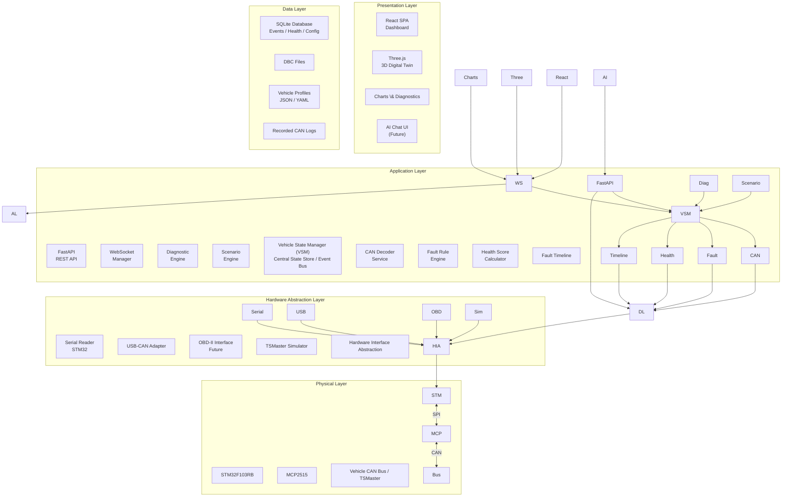

\# AutoTwin AI - System Architecture

```mermaid

flowchart TB


%% ===========================

%% PRESENTATION

%% ===========================


subgraph PL\["Presentation Layer"]


React\["React SPA<br/>Dashboard"]

Three\["Three.js<br/>3D Digital Twin"]

Charts\["Charts \& Diagnostics"]

AI\["AI Chat UI<br/>(Future)"]


end


%% ===========================

%% APPLICATION

%% ===========================


subgraph AL\["Application Layer"]


FastAPI\["FastAPI<br/>REST API"]

WS\["WebSocket<br/>Manager"]

Diag\["Diagnostic<br/>Engine"]

Scenario\["Scenario<br/>Engine"]


VSM\["Vehicle State Manager (VSM)<br/>Central State Store / Event Bus"]


CAN\["CAN Decoder<br/>Service"]

Fault\["Fault Rule<br/>Engine"]

Health\["Health Score<br/>Calculator"]

Timeline\["Fault Timeline"]


FastAPI --> VSM

WS --> VSM

Diag --> VSM

Scenario --> VSM


VSM --> CAN

VSM --> Fault

VSM --> Health

VSM --> Timeline


end


%% ===========================

%% DATA

%% ===========================


subgraph DL\["Data Layer"]


SQLite\["SQLite Database<br/>Events / Health / Config"]

DBC\["DBC Files"]

Profiles\["Vehicle Profiles<br/>JSON / YAML"]

Replay\["Recorded CAN Logs"]


end


%% ===========================

%% HARDWARE

%% ===========================


subgraph HAL\["Hardware Abstraction Layer"]


Serial\["Serial Reader<br/>STM32"]

USB\["USB-CAN Adapter"]

OBD\["OBD-II Interface<br/>Future"]

Sim\["TSMaster Simulator"]


HIA\["Hardware Interface Abstraction"]


Serial --> HIA

USB --> HIA

OBD --> HIA

Sim --> HIA


end


%% ===========================

%% PHYSICAL

%% ===========================


subgraph PHY\["Physical Layer"]


STM\["STM32F103RB"]

MCP\["MCP2515"]

Bus\["Vehicle CAN Bus / TSMaster"]


STM <-- SPI --> MCP

MCP <-- CAN --> Bus


end


%% ===========================

%% CONNECTIONS

%% ===========================


React --> WS

Three --> WS

Charts --> WS

AI --> FastAPI


WS --> AL

FastAPI --> DL


CAN --> DL

Fault --> DL

Health --> DL

Timeline --> DL


DL --> HIA


HIA --> STM

```

