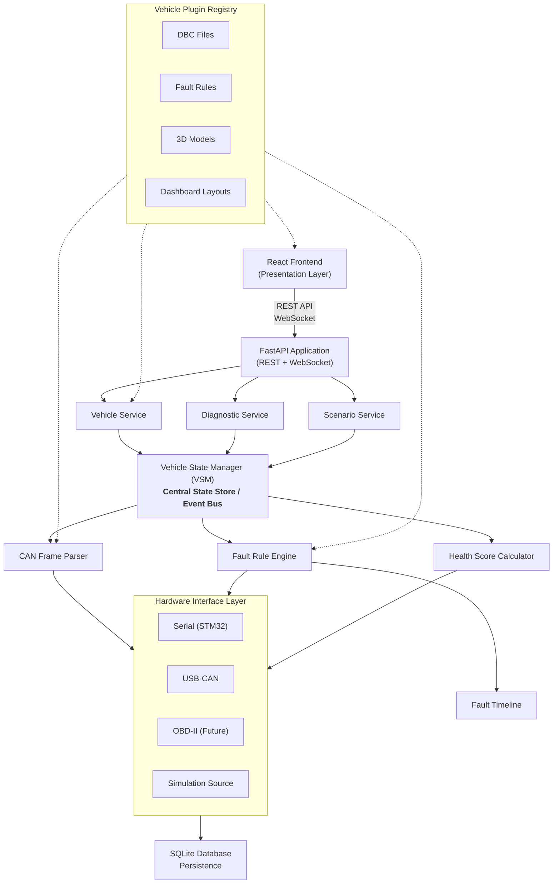

# Module Dependency Graph

```mermaid
flowchart TD

%% =========================
%% Presentation
%% =========================

Frontend["React Frontend<br/>(Presentation Layer)"]

%% =========================
%% API
%% =========================

API["FastAPI Application<br/>(REST + WebSocket)"]

Frontend -->|"REST API<br/>WebSocket"| API

%% =========================
%% Services
%% =========================

VehicleService["Vehicle Service"]
DiagnosticService["Diagnostic Service"]
ScenarioService["Scenario Service"]

API --> VehicleService
API --> DiagnosticService
API --> ScenarioService

%% =========================
%% Core
%% =========================

VSM["Vehicle State Manager (VSM)<br/><b>Central State Store / Event Bus</b>"]

VehicleService --> VSM
DiagnosticService --> VSM
ScenarioService --> VSM

%% =========================
%% Processing
%% =========================

CANParser["CAN Frame Parser"]
FaultEngine["Fault Rule Engine"]
HealthCalc["Health Score Calculator"]
Timeline["Fault Timeline"]

VSM --> CANParser
VSM --> FaultEngine
VSM --> HealthCalc

FaultEngine --> Timeline

%% =========================
%% Hardware
%% =========================

subgraph Hardware["Hardware Interface Layer"]

Serial["Serial (STM32)"]
USBCAN["USB-CAN"]
OBD["OBD-II (Future)"]
Simulator["Simulation Source"]

end

CANParser --> Hardware
FaultEngine --> Hardware
HealthCalc --> Hardware

%% =========================
%% Database
%% =========================

SQLite["SQLite Database<br/>Persistence"]

Hardware --> SQLite

%% =========================
%% Vehicle Plugins
%% =========================

subgraph Plugins["Vehicle Plugin Registry"]

DBC["DBC Files"]
Rules["Fault Rules"]
Models["3D Models"]
Layouts["Dashboard Layouts"]

end

Plugins -.-> VehicleService
Plugins -.-> CANParser
Plugins -.-> FaultEngine
Plugins -.-> Frontend
```